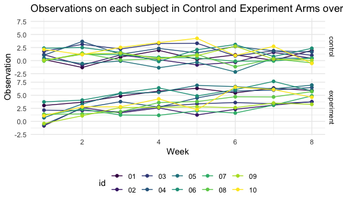

Homework 5
================
Yuanxin Zhang

This is my solution to Homework 5.

## Problem 1

Read in the data.

``` r
homicide_df = 
  read_csv("data/homicide-data.csv") %>% 
  mutate(
    city_state = str_c(city, state, sep = "_"),
    resolved = case_when(
      disposition == "Closed without arrest" ~ "unsolved",
      disposition == "Open/No arrest"        ~ "unsolved",
      disposition == "Closed by arrest"      ~ "solved",
    )
  ) %>% 
  select(city_state, resolved) %>% 
  filter(city_state != "Tulsa_AL")
```

Let’s look at this a bit

``` r
aggregate_df = 
  homicide_df %>% 
  group_by(city_state) %>% 
  summarize(
    hom_total = n(),
    hom_unsolved = sum(resolved == "unsolved")
  )
```

    ## `summarise()` ungrouping output (override with `.groups` argument)

Can I do a prop test for a single city?

``` r
prop.test(
  aggregate_df %>% filter(city_state == "Baltimore_MD") %>% pull(hom_unsolved), 
  aggregate_df %>% filter(city_state == "Baltimore_MD") %>% pull(hom_total)) %>% 
  broom::tidy()
```

    ## # A tibble: 1 x 8
    ##   estimate statistic  p.value parameter conf.low conf.high method    alternative
    ##      <dbl>     <dbl>    <dbl>     <int>    <dbl>     <dbl> <chr>     <chr>      
    ## 1    0.646      239. 6.46e-54         1    0.628     0.663 1-sample… two.sided

Try to iterate ……..

``` r
results_df = 
  aggregate_df %>% 
  mutate(
    prop_tests = map2(.x = hom_unsolved, .y = hom_total, ~prop.test(x = .x, n = .y)),
    tidy_tests = map(.x = prop_tests, ~broom::tidy(.x))
  ) %>% 
  select(-prop_tests) %>% 
  unnest(tidy_tests) %>% 
  select(city_state, estimate, conf.low, conf.high)
```

``` r
results_df %>% 
  mutate(city_state = fct_reorder(city_state, estimate)) %>% 
  ggplot(aes(x = city_state, y = estimate)) +
  geom_point() + 
  geom_errorbar(aes(ymin = conf.low, ymax = conf.high)) + 
  theme(axis.text.x = element_text(angle = 90, vjust = 0.5, hjust = 1))
```


## Problem 2

Import and clean datasets

``` r
path_df = 
  tibble(
    path = list.files("data/p2_data"),
  ) %>% 
  mutate(
    path = str_c("data/p2_data/", path),
    data = map(.x = path, ~read_csv(.))
  ) %>% 
  unnest(data) %>% 
  separate(path, into = c("x1", "arm", "id", "x2"), sep = "([\\_\\.])") %>% 
  select(-c(x1, x2)) %>% 
  mutate(
    arm = case_when(arm == "data/con" ~ "control", arm == "data/exp" ~ "experiment")
  ) 

path_tidy = 
  path_df %>% 
  pivot_longer(
    week_1:week_8,
    names_to = "week",
    names_prefix = "week_",
    values_to = "observation"
  ) %>% 
  mutate(
    id = as.factor(id),
    week = as.numeric(week)
  )
```

Make a spaghetti plot showing observations on each subject over time,
and comment on differences between groups.

``` r
obs_over_time = 
  path_tidy %>%
  group_by(arm, id) %>% 
  ggplot(aes(x = week, y = observation, group = id, color = id)) +
  geom_line() +
  geom_point() +
  facet_grid(arm ~ .) +
  theme(legend.position = "bottom") +
  labs(
    title = "Observations on each subject in Control and Experiment Arms over time",
    x = "Week",
    y = "Observation"
  )
obs_over_time
```



From the spaghetti plot, participants in control arm have a decrease
trend in their observation values, while participants in experiment arm
have an increase trend in their observation values. There is a greater
variation in observations among experiment arm, compared to control arm.

## Problem 3

Conduct a simulation to obtain the estimate, p-value and decision from a
one-sample t-test and generate 5000 datasets.

``` r
t_test = function(mu) {
  if (!is.numeric(mu)) {
    stop("Input must be numeric")
  }
  
  samp = 
    tibble(
    x = rnorm(n = 30, mean = mu, sd = 5)
    )
  
  samp %>% 
    t.test(mu = 0, alternative = 'two.sided', paired = FALSE, conf.level = 0.95) %>%
    broom::tidy() %>% 
    select(estimate, p.value) %>% 
    mutate(
      decision = case_when(p.value < 0.05 ~ "Reject", p.value >= 0.05 ~ "Accept")
    )
}

rerun(5000, t_test(mu = 0)) %>% bind_rows()
```

    ## # A tibble: 5,000 x 3
    ##    estimate p.value decision
    ##       <dbl>   <dbl> <chr>   
    ##  1  -0.243   0.816  Accept  
    ##  2  -0.124   0.883  Accept  
    ##  3  -0.0224  0.984  Accept  
    ##  4  -0.449   0.658  Accept  
    ##  5   0.843   0.312  Accept  
    ##  6   1.04    0.305  Accept  
    ##  7   1.13    0.118  Accept  
    ##  8   1.59    0.0999 Accept  
    ##  9  -0.0338  0.970  Accept  
    ## 10  -0.345   0.601  Accept  
    ## # … with 4,990 more rows

Repeat the above for mu of 1, 2, 3, 4, 5, and 6.

``` r
#trial_mu = 
#  tibble(mu = c(0, 1, 2, 3, 4, 5, 6)) %>% 
#  mutate(
#    results = map(.x = mu, ~rerun(5000, t_test(mu = .x)))
#  )
```
